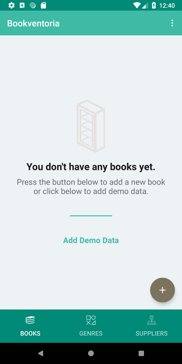

# Bookventoria
Book inventory app for Udacity Android Basics Nanodegree

Youtube: https://youtu.be/wnSOWSrlaZM

For this app, I tried to incorporate everything we learned in the course, including fragments, tablayouts, settings, listviews, etc. 

Screenshots:
  

